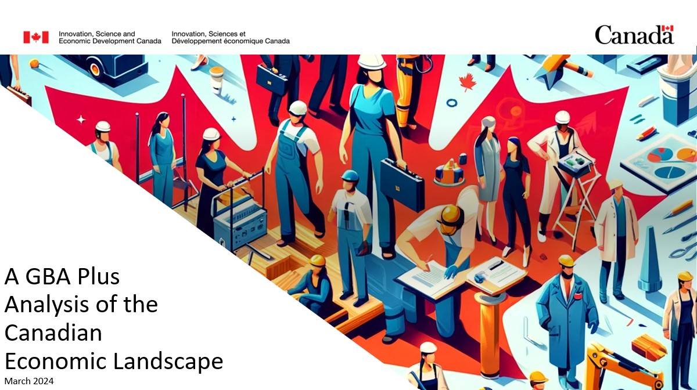
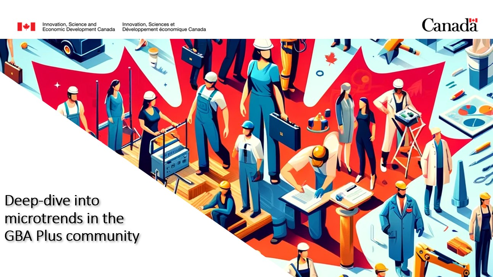
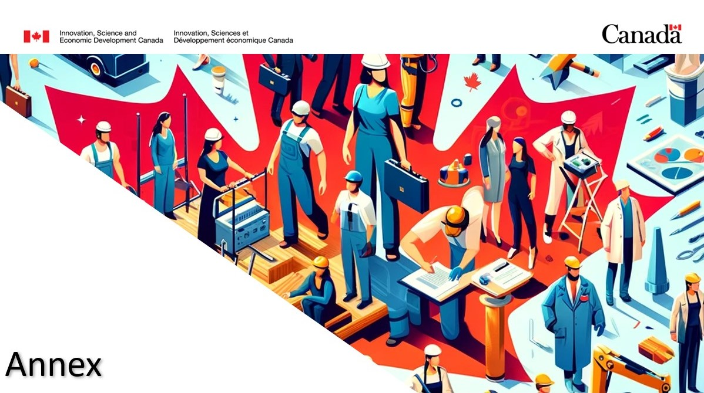

class: middle, center, title-slide-background
background-size: contain

<center>

</center>
---
class: animated slideInRight fadeOutLeft
```{r xaringan-animate-css, echo=FALSE}
xaringanExtra::use_animate_css()
```
```{r xaringan-tachyons, echo=FALSE}
xaringanExtra::use_tachyons()
```
```{r xaringan-fit-screen, echo=FALSE}
xaringanExtra::use_fit_screen()
```
```{r xaringanExtra-search, echo=FALSE}
#controlF
xaringanExtra::use_search(show_icon = TRUE)
```
```{r, echo=FALSE, include = FALSE}
library(fontawesome)
library(icons)
library(rsdmx)
library(readsdmx)
library(knitr)
library(tidyverse)
library(NHSRtheme)
library(xaringanExtra)
library(OECD)
library(rmarkdown)
library(tidyverse)
library(forecast)
library(xts)
library(rmarkdown)
library(openxlsx)
library(XML)
library(reshape2)
library(plyr)
library(ggplot2)
#library(rCharts)
library(dplyr)
library(tidyr)
library(ggcharts)
library(ggpol)
library(RColorBrewer)
library(highcharter)
library(vtable)
library(webshot)
library(scales)
library(statcanR)
library(tidyverse)
library(writexl)
library(highcharter)  # Make sure you have the highcharter library installed
library(readxl)
```
```{r icon_find, echo=FALSE, include=FALSE}
#install.packages("fontawesome")
#icon_find("economist")
```

##Executive summary

- <span style="font-size: 22px;"> 
<strong>  Gender gaps, amongst both minority and white Canadians in the labour force have been tightening </strong> since the pandemic, but wage disparities persist. 


- <span style="font-size: 22px;"> 
Canadian <strong>women in all minority groups have increased educational attainment</strong>, but this has not translated into a higher rate of innovative activities such as inventions, entrepreneurship, and firm ownership.


- <span style="font-size: 22px;"> 
Public policies such as the <strong>10$/day child-care benefit have had a positive impact on participation rates </strong>for Canadian women with small children.


<div class="subpoints" style="position: absolute; top: 0; left: 0; width: 100%; padding: 10px; background-color: #CFECF5; text-align: center;">
 <span class="small-font"> Economy</span> 
  <span class="small-font" style="margin-left: 100px;">Demography</span>
  <span class="small-font" style="margin-left: 100px;">Standard of Living</span>
</div>
---
class: animated slideInRight fadeOutLeft

##Annual Report

<strong>Objective:</strong> To provide a comprehensive assessment of Canada’s past economic performance,outcomes and trends across diverse social groups in inform ISED’s mandate and goals. 

<span style="font-size: 22px;"> 
![:col_header Key points, Takeaways, Driving action]
![:col_list Baseline assessment of Canada’s Economic landscape, Align findings with ISED’s mandate and strategic priorities
, Catalyst for evidence based policy formulation]
![:col_list Analysis of economic outcomes and trends for various social groups,Translate insights into actionable recommendations , Facilitate stakeholder collaboration and engagement]
![:col_list Data driven insights to drive informed decision making, Empower decision makers for inclusive economic growth, ]


By providing a comprehensive baseline assessment of Canada’s past economic performance and leveraging this analysis to develop substantive insights and strategic takeaways aligned.


With ISED’s mandate, the annual report serves as a cornerstone for informed decision-making and meaningful action, ensuring that ISED remains at the forefront of driving inclusive and sustainable economic development in an evolving economy


<div class="subpoints" style="position: absolute; top: 0; left: 0; width: 100%; padding: 10px; background-color: #CFECF5; text-align: center;">
 <span class="small-font"> Economy</span> 
  <span class="small-font" style="margin-left: 100px;">Demography</span>
  <span class="small-font" style="margin-left: 100px;">Standard of Living</span>
</div>
---
class: animated slideInRight fadeOutLeft

<center>

</center>

---
class: animated slideInRight fadeOutLeft

```{r,include=FALSE}
GDP_capita <- "https://sdmx.oecd.org/public/rest/data/OECD.SDD.NAD,DSD_NAMAIN10@DF_TABLE1_EXPENDITURE_HCPC,1.0/A.JPN+ITA+OECD+CAN+FRA+DEU+GBR+USA...B1GQ_POP.......?startPeriod=2000&endPeriod=2022&dimensionAtObservation=AllDimensions"
dataset <- readSDMX(GDP_capita)
GDPpercapita <- as.data.frame(dataset)
```

```{r, echo=FALSE, include=FALSE}
GDPpercapita1 <- GDPpercapita %>%
  select(REF_AREA, TIME_PERIOD, obsValue) %>%
  pivot_wider(names_from = REF_AREA, values_from = obsValue)

GDPpercapita1
```
### Canada's economic growth has outpaced most of its G7 counterparts since 2020

<center>
```{r, echo=FALSE, fig.align='center', fig.width=9, fig.height=6.55}
gdp_percapita_chart <- highchart()%>%
  hc_chart(type = "line",  zoomType = "xy") %>%
  hc_subtitle(
    text = "Annual GDP per capita, US$, current prices",
    align = "center"
  ) %>%
  hc_xAxis(categories = GDPpercapita1$TIME_PERIOD) %>%
  hc_add_series(
    name = "United States",
    type = "line",
    data = GDPpercapita1$USA,
    color = "#191970"
  ) %>%
  hc_add_series(
    name = "Germany",
    type = "line",
    data = GDPpercapita1$DEU,
    color = "#87CEEB"
  ) %>%
  hc_add_series(
    name = "Canada",
    type = "line",
    data = GDPpercapita1$CAN,
    color = "#FF0000"
  ) %>%
  hc_add_series(
    name = "France",
    type = "line",
    data = GDPpercapita1$FRA,
    color = "#6495ED"
  ) %>%
  hc_add_series(
    name = "Great Britain",
    type = "line",
    data = GDPpercapita1$GBR,
    color = "#5F9EA0"
  ) %>%
  hc_add_series(
    name = "OECD Average",
    type = "line",
    data = GDPpercapita1$OECD,
    color ="grey"
  ) %>%
  hc_add_series(
    name = "Italy",
    type = "line",
    data = GDPpercapita1$ITA,
    color ="#ADD8E6"
  ) %>%
  hc_add_series(
    name = "Japan",
    type = "line",
    data = GDPpercapita1$JPN,
    color =  "#0000FF"
  ) %>%
  hc_add_theme(hc_theme_hcrt()) %>%
  hc_plotOptions(
    column = list(
      dataLabels = list(enabled = TRUE)
    )
  ) %>%
  hc_tooltip(
    pointFormat = '{series.name}: <b>{point.y:.0f}</b><br/>',
    shared = TRUE
  )%>%
  hc_caption(text = "Source: OECD")

gdp_percapita_chart
```
</center>
```{r, echo=FALSE}
gender_wagegap <- "https://sdmx.oecd.org/public/rest/data/OECD.SDD.NAD,DSD_NAMAIN10@DF_TABLE1_EXPENDITURE_HCPC,1.0/A.JPN+ITA+OECD+CAN+FRA+DEU+GBR+USA...B1GQ_POP.......?startPeriod=2000&endPeriod=2022&dimensionAtObservation=AllDimensions"
dataset1 <- readSDMX(gender_wagegap)
wagegap <- as.data.frame(dataset1)
```

---
class: animated slideInRight fadeOutLeft

### Despite progress in narrowing the gender labour gap over time, significant disparities in wages persist.
.pull-left[.full-width[.content-box-blue[`r icons::fontawesome("bell")`    There remains a nearly <strong>8pp disparity </strong>between working-age men and women’s participation rates.]]]

```{r, echo=FALSE}
part_rate <-  read_excel("C:/Users/davreuxa/OneDrive - ISED-ISDE/GBA+ Annual Report/sme_ownership.xlsx", sheet = "Part_rateby sex")
```
```{r participation rate, echo=FALSE}
partrate_graph <- highchart() %>%
  hc_chart(type = "line",  zoomType = "xy") %>%
  hc_subtitle(
    text = "Participation rates by sex, %",
    align = "center"
  ) %>%
  hc_xAxis(categories = part_rate$Date) %>%
  hc_add_series(
    name = "Men",
    type = "line",
    data = part_rate$Males
  ) %>%
  hc_add_series(
    name = "Women",
    type = "line",
    data = part_rate$Females
  ) %>%
  hc_add_theme(hc_theme_hcrt()) %>%
  hc_plotOptions(
    column = list(
      dataLabels = list(enabled = TRUE)
    )
  ) %>%
  hc_tooltip(
    pointFormat = '{series.name}: <b>{point.y:.1f}%</b><br/>',
    shared = TRUE
  )%>%
  hc_colors(colors = c("grey", "#A4B9CE")) 

partrate_graph
```


---
### Women and Canada's Gross Domestic Product: A Growing Contribution
<center>
From 2008 to 2018, the contribution of women to Canada’s gross domestic product (GDP) rose 2.8%pp to 28.5%, while the contribution of men edged up 0.5pp to 49.2%.
</center>

```{r, echo=FALSE}
require(dplyr)

mapdata <- get_data_from_map(download_map_data("countries/ca/ca-all"))
GDP_contribution <-  read_excel("C:/Users/davreuxa/OneDrive - ISED-ISDE/GBA+ Annual Report/sme_ownership.xlsx", sheet = "GDP")
map_data1 <- read_excel("C:/Users/davreuxa/OneDrive - ISED-ISDE/GBA+ Annual Report/mapdata.xlsx")

```
.pull-left[
```{r, echo=FALSE, fig.align='center'}
hcmap(
  "countries/ca/ca-all",
  data = GDP_contribution,
  value = GDP_contribution$value,
  joinBy = c("hc-a2", "code"),
  name = "Women's contribution to GDP",
  dataLabels = list(enabled = TRUE, format = "{point.name}"),
  borderColor = "#FAFAFA",
  borderWidth = 0.1,
  tooltip = list(
    valueDecimals = 1,
    valuePrefix = " ",
    valueSuffix = "%"
  )
)
```
]

.pull-right[
```{r, echo=FALSE}
GDP_sectoral <-  read_excel("C:/Users/davreuxa/OneDrive - ISED-ISDE/GBA+ Annual Report/sme_ownership.xlsx", sheet = "GDP_sectoral")
```
```{r, echo=FALSE, fig.height=6.65}
gdpsectoral <- highchart() %>%
  hc_chart(type = "bar",  zoomType = "xy") %>%
  hc_subtitle(
    text = "Gross domestic product contribution share, by gender and industry",
    align = "center"
  ) %>%
  hc_xAxis(categories = GDP_sectoral$Industry) %>%
  hc_add_series(
    name = "Men",
    type = "bar",
    data = GDP_sectoral$Men
  ) %>%
  hc_add_series(
    name = "Women",
    type = "bar",
    data = GDP_sectoral$Women
  ) %>%
  hc_add_theme(hc_theme_hcrt()) %>%
  hc_plotOptions(
    column = list(
      dataLabels = list(enabled = TRUE)
    )
  ) %>%
  hc_tooltip(
    pointFormat = '{series.name}: <b>{point.y:.1f}%</b><br/>',
    shared = TRUE
  )%>%
  hc_colors(colors = c("grey", "#A4B9CE")) 


gdpsectoral
```
]
---
### Male-owned firms exhibit a higher propensity to allocate resources towards research and development (R&D) as well as patents.


.pull-left[
- <span style="font-size: 17px;"> 
The gender gap in terms of firm ownership was disproportionately higher among the Black population, but continues to be significant other minority groups.
```{r, include=FALSE}
immig_own <- read_excel("C:/Users/davreuxa/OneDrive - ISED-ISDE/GBA+ Annual Report/sme_ownership.xlsx", sheet = "firmown")
```
```{r, include=FALSE}
immigown_chart <- highchart() %>%
  hc_chart(type = "bar",  zoomType = "xy") %>%
  hc_subtitle(
    text = "Distribution of business owners, by gender, immigration status, and racial profile, 2018 ",
    align = "center"
  ) %>%
  hc_xAxis(categories = immig_own$race) %>%
  hc_add_series(
    name = "Recent immigrants",
    type = "bar",
    data = immig_own$`Recent Immigrants`
  ) %>%
  hc_add_series(
    name = "Established immigrants",
    type = "bar",
    data = immig_own$`Established immigrants`
  ) %>%
  hc_add_series(
    name = "Non-immigrants",
    type = "bar",
    data = immig_own$`Non-immigrants`
  ) %>%
  hc_add_theme(hc_theme_hcrt()) %>%
  hc_plotOptions(
    column = list(
      dataLabels = list(enabled = TRUE)
    )
  ) %>%
  hc_tooltip(
    pointFormat = '{series.name}: <b>{point.y:.1f}%</b><br/>',
    shared = TRUE
  )%>%
  hc_caption(text = "Note: Recent immigrants refers to immigrants who arrived in Canada between 2013 and 2018. </br/> Source: CEEDD (2018); Census of population; National household survey" )
  
```
```{r, echo=FALSE, fig.height=5.15}
immigown_chart
```
]

.pull-right[
- <span style="font-size: 17px;"> 
Men-owned businesses were 16.5 percentage points more likely to have conducted R&D, and, conditional on conducting R&D, spent 70% more.
```{r, include=FALSE}
patents <- read_excel("C:/Users/davreuxa/OneDrive - ISED-ISDE/GBA+ Annual Report/sme_ownership.xlsx", sheet = "patents")
```
```{r, include=FALSE}
patents_chart <- highchart() %>%
  hc_chart(type = "bar", stacked = TRUE, zoomType = "xy") %>%
  hc_subtitle(
    text = "Number of patent applications by gender of ownership, average over each period",
    align = "center"
  ) %>%
  hc_xAxis(categories = patents$Period) %>%
  hc_add_series(
    name = "Men-owned",
    type = "bar",
    data = patents$`Men-owned patents`,
    stacking="normal"
  ) %>%
  hc_add_series(
    name = "Women-owned",
    type = "bar",
    data = patents$`Women-owned patents`,
      stacking="normal"
  ) %>%
   hc_add_series(
    name = "Equally-owned",
    type = "bar",
    data = patents$`Equally owned patents`,
      stacking="normal"
  ) %>%
  hc_add_theme(hc_theme_hcrt()) %>%
  hc_plotOptions(
    column = list(
      dataLabels = list(enabled = TRUE)
    )
  ) %>%
  hc_tooltip(
    pointFormat = '{series.name}: <b>{point.y:.1f}</b><br/>',
    shared = TRUE
  )%>%
  hc_caption(text = "Source: Canadian Patent Research Database and Canadian Employer-Employee Dynamics Database.")%>%
  hc_yAxis(visible = FALSE)

```
```{r PATENTS, echo=FALSE, fig.height=5.0}
patents_chart
```
]

---
### A GBA Plus review of Canada’s Self-employment and Entrepreneurial Activities
.pull-left[
<span style="font-size: 17px;">
<center><strong> Entrepreneurship in Canada </strong></center>
- <span style="font-size: 17px;"> 
Entrepreneurial activity is a key driver of the Canadian economy, and helps drive innovation, productivity, job creation, and foster competition and economic growth across the country.


- <span style="font-size: 17px;"> 
Entrepreneurs are also key to offering positive social benefits to Canadian society; immigrants are more likely to be self-employed than non-immigrant counterparts and some target their communities with entrepreneurial goods and services. 
]

.pull-right[
<span style="font-size: 17px;">
<center><strong> GBA+ Lens: Self-Employment and Entrepreneurship</strong></center>
- <span style="font-size: 17px;"> 
Self-employed women are less likely to have employees than men (19% vs. 32% in 2022)., and women are less likely to be an entrepreneur (have an incorporated business) than men. 
- <span style="font-size: 17px;"> 
Overall, the entrepreneurial gender gap is decreasing. There is an increasing number of women entrepreneurs; however, Canada lags behind the United States. 
- <span style="font-size: 17px;"> 
Most black (with the exception of Black women) and racialized business owners are immigrants; both Black and racialized immigrants seek out entrepreneurial opportunities due to challenges in securing employment. 
- <span style="font-size: 17px;"> 
Entrepreneurship remains a challenging business opportunity for women, Black and racialized Canadians who face systemic barriers that hinder business opportunities.

]
---
<center>

</center>
---
##Women in Senior management positions in Canadian Firms 

```{r, include=FALSE}
mgmt <- read_excel("C:/Users/davreuxa/OneDrive - ISED-ISDE/GBA+ Annual Report/sme_ownership.xlsx", sheet = "mgmt")
```

```{r, include=FALSE}
mgmt_chart <- highchart() %>%
  hc_chart(type = "bar", zoomType = "xy") %>%
  hc_title(
    text = "Women are more likely to hold senior management positions only if the business is majority female owned",
    align = "center"
  ) %>%
  hc_subtitle(
    text = "Average percentage of women in senior management positions, Q1 2023",
    align = "center"
  ) %>%
  hc_xAxis(categories = mgmt$`Percentage of employees`) %>%
  hc_add_series(
    name = "Women in Senior Management",
    type = "bar",
    data = mgmt$`Average percentage of employees that are women in senior management positions`
  ) %>%
  hc_add_series(
    name = "Men in senior Management",
    type = "bar",
    data = mgmt$`Average percentage of employees that are men in senior management positions`
  ) %>%
  hc_add_theme(hc_theme_bloom()) %>%
  hc_plotOptions(
    column = list(
      dataLabels = list(enabled = TRUE)
    )
  ) %>%
  hc_tooltip(
    pointFormat = '{series.name}: <b>{point.y:.1f}%</b><br/>',
    shared = TRUE
  )%>%
  hc_caption(text = "Source: Statistics Canada Table 33-10-0660-01")%>%
  hc_yAxis(visible = FALSE)


```
.pull-left[
```{r, echo=FALSE}
mgmt_chart
```
]

```{r, include=FALSE}
int_board <- read_excel("C:/Users/davreuxa/OneDrive - ISED-ISDE/GBA+ Annual Report/sme_ownership.xlsx", sheet = "int_board")

intboard_chart <-highchart()%>%
  hc_chart(type = "bar",  zoomType = "xy") %>%
  hc_title(
    text = "Compared to our peers, Canadian women hold nearly the least amount of board seats, only slightly above the U.S.",
    align = "center"
  ) %>%
  hc_subtitle(
    text = "Female share of board seats of the largest publically listed companies, (%)",
    align = "center"
  ) %>%
  hc_xAxis(categories = int_board$country) %>%
  hc_add_series(
    name = "Share of board seats held by women",
    type = "bar",
    data = int_board$value
  ) %>%
  hc_add_theme(hc_theme_bloom()) %>%
  hc_plotOptions(
    column = list(
      dataLabels = list(enabled = TRUE)
    )
  ) %>%
  hc_tooltip(
    pointFormat = '{series.name}: <b>{point.y:.1f}%</b><br/>',
    shared = TRUE
  )%>%
  hc_caption(text = "Source: OECD")

```
.pull-right[
```{r, echo=FALSE}
intboard_chart
```
]

---
##Small-Medium Sized Firm Ownership

```{r SME, include = FALSE}
sme <- read_excel("C:/Users/davreuxa/OneDrive - ISED-ISDE/GBA+ Annual Report/sme_ownership.xlsx", sheet = "sme_ownership")
```
```{r , include=FALSE}
sme_chart <- highchart() %>%
  hc_chart(type = "column", zoomType = "xy")%>%
  hc_title(text = "Women, Visible Minorities, and Indigenous folk disproportionally own fewer SMEs", align = "center") %>%
  hc_subtitle(text= "Ownership characteristics of small and medium enterprises, (%)", align = "center")%>%
  hc_xAxis(categories = sme$`ownership`) %>%
  hc_add_series(
    name = "1 to 4 employees",
    type = "column",
    data = sme$`Employment size, 1 to 4 employees`
  ) %>%
  hc_add_series(
    name = "5 to 19 employees",
    type = "column",
    data = sme$`Employment size, 5 to 19 employees`
  ) %>%
  hc_add_series(
    name = "20 to 99 employees",
    type = "column",
    data = sme$`Employment size, 20 to 99 employees`
 )%>%
  hc_add_series(
    name = "100 to 499 employees",
    type = "column",
    data = sme$`Employment size, 100 to 499 employees`
 )%>%
  hc_add_theme(hc_theme_bloom())%>%
  hc_plotOptions(column = list(dataLabels = list(enabled = TRUE)))%>%
  hc_caption(text="Source: Statistics Canada Table 33-10-0459-01")

```
<center>
```{r, echo=FALSE, fig.align='center', fig.width=10, fig.height=7}
sme_chart
```
</center>
---
##Larger firms are more likely to innovate
```{r, include=FALSE}
ipp <- read_excel("C:/Users/davreuxa/OneDrive - ISED-ISDE/GBA+ Annual Report/sme_ownership.xlsx", sheet = "ipp")
```
```{r, include=FALSE}
ipp_chart <- highchart() %>%
  hc_chart(type = "column", zoomType = "xy")%>%
  hc_title(text = "  ", align = "center") %>%
  hc_subtitle(text= "Intellectual Property Use, by firm size and ownership type", align = "center")%>%
  hc_xAxis(categories = ipp$ipp) %>%
  hc_add_series(
    name = "IPP Use",
    type = "column",
    data = ipp$value
  ) %>%
  hc_add_theme(hc_theme_bloom())%>%
  hc_plotOptions(column = list(dataLabels = list(enabled = TRUE)))%>%
  hc_caption(text="Source: Statistics Canada Table 33-10-0459-01")

```

<center>
```{r , echo=FALSE, fig.align='center', fig.width=10, fig.height=7}
ipp_chart
```
</center>
